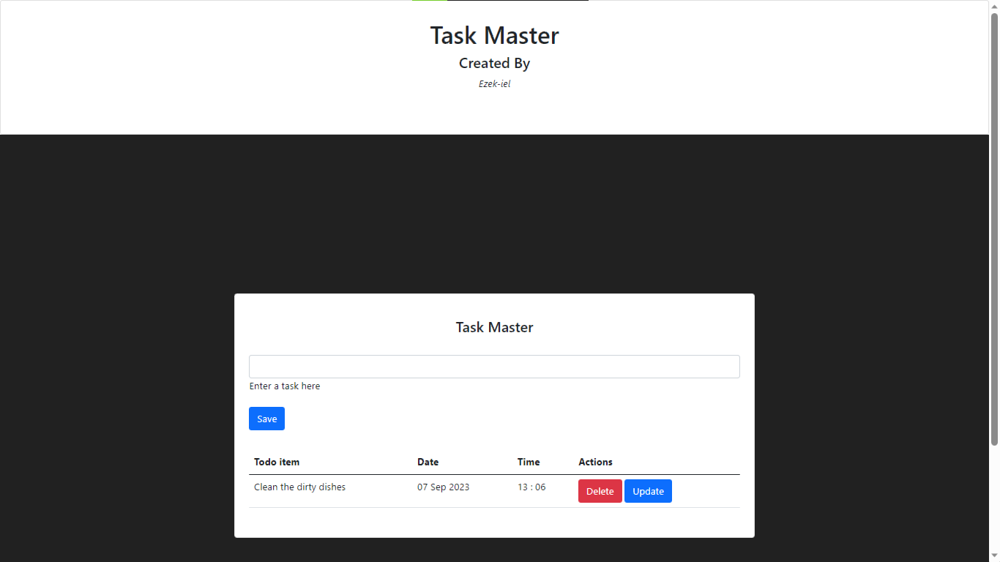

# Task_Master
 A basic Todo App using Flask with CRUD Implementation

## Preview
This is a basic CRUD application using Flask and SQLAlchemy, running on a SQlite3 database



> -- Flask is a Micro Web Framework which the wsgi interface and jinja templating syntax.

> -- SQLAlchemy is a ORM (Object Relational Mapper) for flask databases. It can be installed via.

```python
python -m pip3 install flask-sqlalchemy
```

```python
python -m pip3 install flask
```

> -- SQlite3 is a mini-database which can be used with a variety of frameworks such as Django and Fast.  
-- Sqlite 3 is pre-installed with python already

> Styling is done via Bootstrap CSS
